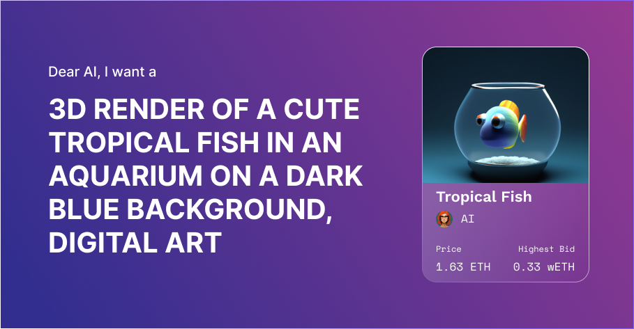

# Generative Art (AI)

Artificial Intelligence (AI) has been making a lot of noise lately and for good reason. It has the potential to revolutionize the way we do things in numerous industries, including the world of NFTs. NFTs, or Non-Fungible Tokens, are unique digital assets that are stored on a blockchain network. They are becoming increasingly popular as a way to verify the authenticity of digital art and collectibles.

Evelon leverages AI for the image generation in NFTs, offering a no-code solution for creating dynamic NFTs. This platform allows users to create NFTs without needing any technical expertise. The AI-powered image generator can be used to create unique digital assets, including images, videos, and animations. This has opened up a whole new world of possibilities for NFT creators and collectors, who can now easily create NFTs in a variety of styles and forms.

One of the main benefits of AI-generated images is their speed and efficiency. Unlike traditional methods of image creation, AI algorithms can produce an image in a fraction of the time it takes a human artist. This increased speed can lead to increased productivity and profitability for businesses operating in the visual arts industry.

Another advantage of AI-generated images is their ability to reduce costs. By using AI algorithms, businesses can eliminate the need for expensive artists and designers. This reduction in costs can be passed on to the customer, providing an attractive alternative for those seeking affordable visual art solutions.

## Technology
Evelon's AI-generated images are also highly versatile. The technology can generate images in a variety of styles, including realistic, cartoonish, and abstract. This versatility allows businesses to create images that are suitable for a wide range of applications, such as advertising, branding, and product design.

In addition, AI-generated images can be used to create customized images that are specific to the customer's needs. This is achieved through machine learning algorithms that can learn from the customer's preferences and create images that are tailored to their needs. This level of personalisation can lead to increased customer satisfaction and brand loyalty.

In conclusion, the introduction of AI-generated images using Evelon technology can revolutionize the visual arts industry. Its benefits of speed, cost-effectiveness, versatility, personalisation, and high quality make it an attractive solution for businesses seeking to stay ahead of the competition. As AI continues to evolve, we can expect to see even more exciting developments in the world of visual art.
