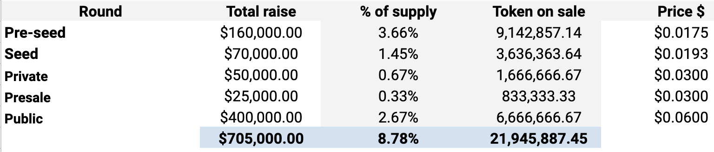

# Tokenomics
!!! WIP
The final tokenomics will be published in the first week of Oct. We refined the tokenomics slightly to meet with requirements from launchpads and exchanges.
!!!
Tokenomics determine two things about our token economy – the incentives that set out how the token will be distributed and the utility of the tokens that influence its demand. A large portion (from 62%) will be used for marketing and governance utilities reducing the circulating supply in an automated way.

## Token sale & Valuation

